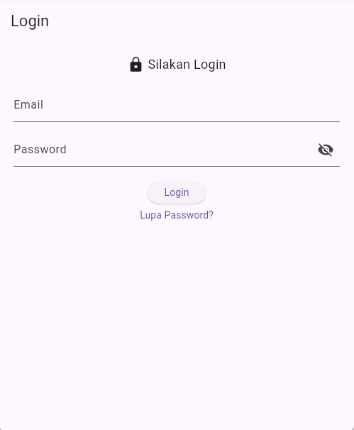
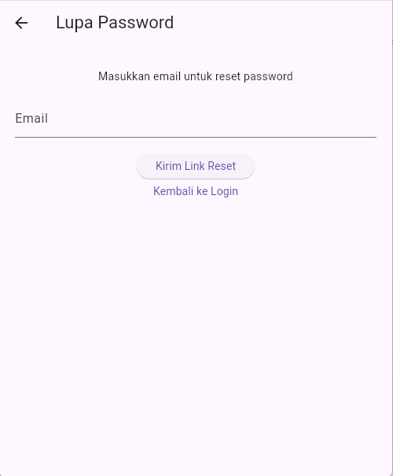
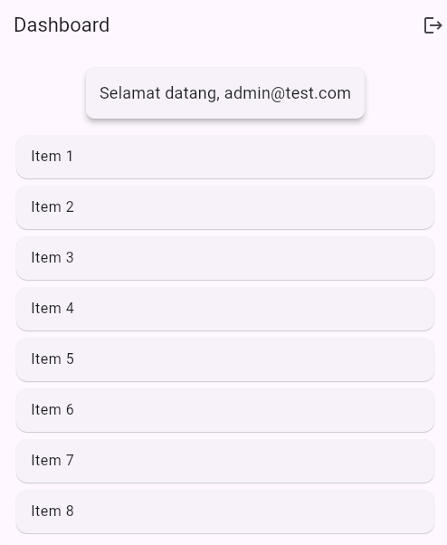

# Flutter Login App

## Deskripsi Aplikasi
Aplikasi ini adalah aplikasi login sederhana berbasis Flutter yang memiliki fitur autentikasi login, halaman forgot password, dan dashboard setelah berhasil login. \

## Daftar Fitur
- Login dengan validasi email dan password
- Halaman Forgot Password
- Dashboard setelah login berhasil
- Custom reusable widget (button & textfield)
- Loading state saat proses login
- Navigasi antar halaman menggunakan route
- Form validation

## Cara Menjalankan Aplikasi
flutter pub get
flutter run

## Screenshot Aplikasi

### Login Page

### Forgot Password Page

### Dashboard Page

## Daftar Package yang Digunakan
- flutter (SDK utama Flutter)
- cupertino_icons: ^1.0.8 (ikon bawaan iOS style)